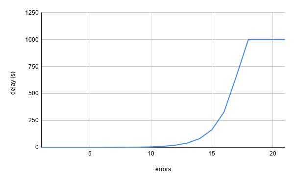
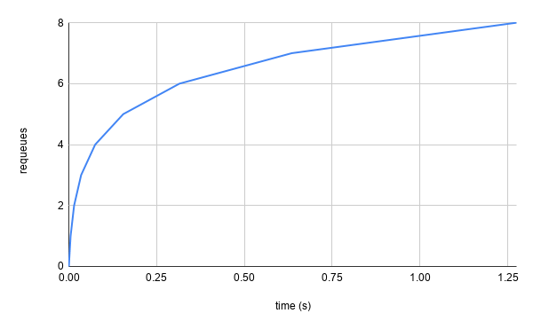
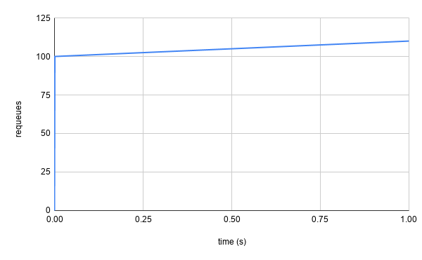
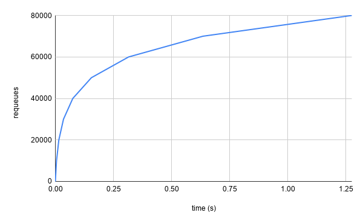

+++
title = '在K8s controller-runtime和client-go中实现速率限制'
date = 2024-06-16T16:02:23+08:00
draft = false
+++

这是旨在澄清、易懂和完整的版本：

本文章是 [controller-runtime 和 client-go 中的速率限制](https://danielmangum.com/posts/controller-runtime-client-go-rate-limiting/) 的中文翻译。内容有所删减。

如果您曾经编写过 [Kubernetes 控制器](https://kubernetes.io/docs/concepts/architecture/controller/)，您可能熟悉 [controller-runtime](https://github.com/kubernetes-sigs/controller-runtime)，或者至少了解 [client-go](https://github.com/kubernetes/client-go)。 `controller-runtime` 是用于构建控制器的框架，允许用户设置多个控制器，并由控制器管理器进行管理。在幕后，`controller-runtime` 使用 `client-go` 与 [Kubernetes API 服务器](https://kubernetes.io/docs/reference/command-line-tools-reference/kube-apiserver/) 进行通信，以监视资源变化并将其传递给相关的控制器。它处理了许多与控制器相关的方面，包括缓存、队列等。其中一个组件是速率限制。

## 速率限制是什么？

自从计算机网络问世以来，限流（Rate Limiting）就一直存在于软件中，在此之前也存在于许多其他人类流程中。当讨论限流时，您可能会发现与您日常执行任务、公司和社区组织模式有许多相似之处。

在实现任何两方之间的有效通信时，限流是必要的。软件通过在不同的执行过程之间传递消息进行通信，无论是通过操作系统、专用硬件设备、网络还是三者的组合。在客户端-服务器模型中，客户端通常会请求服务器代表其执行工作。服务器执行这些工作需要时间，这意味着如果有许多客户端同时请求服务器执行工作，而服务器容量不足以处理这些请求，服务器就需要做出选择。

服务器可以选择：
1. 丢弃没有响应的请求。
2. 等待请求的响应，直到可以完全执行工作。
3. 响应请求，指示当前无法执行工作，但客户端应在未来的某个时间再次请求执行工作。
4. 将工作添加到队列中，并响应请求，告知客户端在完成工作时会通知客户端。

如果客户端和服务器彼此非常了解（即它们对彼此的通信模式非常熟悉），那么上述任何一种方法都可以作为有效的通信模型。想象一下您与生活中其他人的关系。您可能会认识那些以各种方式进行沟通的人，但如果通信方式是彼此了解的，您可能能够与所有这些人有效地合作。

不幸的是，与人类一样，软件也可能不可靠。例如，服务器可能会表示将在未来的某个时间响应请求，要求客户端在该时间再次请求执行工作，但客户端与服务器之间的连接可能被阻塞，导致请求被丢弃。同样地，客户端可能会收到回复，表示工作在未来的某个时间才能执行，但它可能会继续请求立即执行工作。因为这些原因以及其他许多原因（我们今天不会讨论的），服务器端和客户端的限流对于构建可扩展、可靠的系统至关重要。

由于 `controller-runtime` 和 `client-go` 是构建 Kubernetes 控制器的框架，而控制器是 Kubernetes API 服务器的客户端，所以今天我们将重点关注客户端的限流。

## 控制器是什么？

如果您对 `controller-runtime` 已经非常了解，可以跳过这一部分。
`controller-runtime` 主要通过执行一个由 [controller abstraction](https://github.com/kubernetes-sigs/controller-runtime/blob/e1a725df2743147795e5dfc8275365f7ada24805/pkg/controller/controller.go#L61) 实现并传递给框架的 [reconciliation loop](https://book.kubebuilder.io/cronjob-tutorial/controller-implementation.html#implementing-a-controller)）向使用者提供控制器抽象。以下是一个简单的 [`Reconciler`](https://github.com/kubernetes-sigs/controller-runtime/blob/e1a725df2743147795e5dfc8275365f7ada24805/pkg/reconcile/reconcile.go#L89) 示例，可传递给 `controller-runtime` 控制器：

```golang
type Reconciler struct {}

func (r *Reconciler) Reconcile(ctx context.Context, req reconcile.Request) (reconcile.Result, error) {
    fmt.Println("Reconciling something!")
    return reconcile.Result{}, nil
}

```

这是一个更加复杂的 [reconciliation loop](https://github.com/crossplane/crossplane/blob/5f239dbb7c399a8d544518be2be23ad16f98a71d/internal/controller/pkg/manager/reconciler.go#L216) 的例子。

`controller-runtime` 通过控制器的 [builder pattern](https://en.wikipedia.org/wiki/Builder_pattern) 接受上述 reconciliation loop，允许使用者指定应该触发此 reconciliation 的资源。下面是一个控制器的例子，它会对 `Pod` 上的任何 CRUD 操作做出响应：

```golang
ctrl.NewControllerManagedBy(mgr).
    Named("my-pod-controller").
    For(&v1.Pod{}).
    Complete(&Reconciler{})
```

暂时忽略控制器管理器（`mgr`），您可以看到我们传递了一个控制器的名称（`my-pod-controller`），我们希望它调和的类型（`v1.Pod`），以及实际执行调和的 `&Reconciler{}`。还有其他选项可以在控制器构建器中传递，我们稍后会探讨一些选项（以及一些我们不会讨论的选项），以进一步自定义其行为。

每个 `Reconciler` 都需要实现 `Reconcile(ctx context.Context, req reconcile.Request) (reconcile.Result, error)` 方法。当 `watched` 对象发生更改时，`controller-runtime` 将调用该方法。触发对象的信息（在本例中是 Pod）通过 [`reconcile.Request`](https://github.com/kubernetes-sigs/controller-runtime/blob/e1a725df2743147795e5dfc8275365f7ada24805/pkg/reconcile/reconcile.go#L47) 传递。在 `reconciliation` 中，使用者可以选择使用这些信息通过 `client-go` 或 controller-runtime 提供的 [`Client`](https://github.com/kubernetes-sigs/controller-runtime/blob/e1a725df2743147795e5dfc8275365f7ada24805/pkg/client/interfaces.go#L100) 抽象从 API 服务器获取对象。让我们对 `Reconciler` 进行更详细的扩展：

```Golang
type Reconciler struct {
    client client.Client
}

func (r *Reconciler) Reconcile(ctx context.Context, req reconcile.Request) (reconcile.Result, error) {
    p := &v1.Pod{}
    if err := r.client.Get(ctx, req.NamespacedName, p); err != nil {
        reconcile.Result{}, err
    }
    fmt.Println(p.Name)
    return reconcile.Result{}, nil
}
```
现在我们用[`NamespacedName`](https://github.com/kubernetes/apimachinery/blob/c93b0f84892eb6bcbc80b312ae70729d8168bc7e/pkg/types/namespacedname.go#L27)来获取需要reconciliation的对象。我们可能无法从 API 服务器获取对象，在这种情况下我们返回`err`。否则，我们将返回`nil`。

> 请注意，当我们说向 API 服务器发出请求时，这并不一定意味着我们正在通过网络调用来访问对象。如前所述，`controller-runtime` 使用[caching](https://github.com/kubernetes-sigs/controller-runtime/blob/e1a725df2743147795e5dfc8275365f7ada24805/pkg/cache/cache.go#L41)来使控制器管理器管理的控制器的操作更有效。我们不会深入探讨缓存是如何执行的，但如果有足够多的人发现这篇文章有用，我会写一篇关于缓存的文章。
  

下面是一些关于kubernetes控制器的介绍的文章：
*   [Kubebuilder CronJob Tutorial](https://book.kubebuilder.io/cronjob-tutorial/cronjob-tutorial.html)
*   [“A deep dive into Kubernetes controllers” - Bitnami Blog](https://engineering.bitnami.com/articles/a-deep-dive-into-kubernetes-controllers.html)
*   [Building an Enterprise Infrastructure Control Plane on Kubernetes](https://youtu.be/4ceaeaLYaPs)
*   [TGI Kubernetes 145: Duck Typing in Kubernetes](https://youtu.be/slX2nAFHeK0)

### 当失败时会发生什么？

让我们来看一下 [`reconcile.Result` struct](https://github.com/kubernetes-sigs/controller-runtime/blob/e1a725df2743147795e5dfc8275365f7ada24805/pkg/reconcile/reconcile.go#L27) 结构体，看看我们告诉 `controller-runtime` 接下来该做什么的选项

```golang
// Result contains the result of a Reconciler invocation.
type Result struct {
  // Requeue tells the Controller to requeue the reconcile key.  Defaults to false.
  Requeue bool

  // RequeueAfter if greater than 0, tells the Controller to requeue the reconcile key after the Duration.
  // Implies that Requeue is true, there is no need to set Requeue to true at the same time as RequeueAfter.
  RequeueAfter time.Duration
}
```

因此，我们可以选择在一段时间后重新进入队列，立即重新进入队列，或者根本不重新进入队列。然后还有我们返回的`error`。这些值的排列组合以及`controller-runtime`如何对它们做出响应如下所述（您也可以直接查看[源代码](https://github.com/kubernetes-sigs/controller-runtime/blob/16bf3ad036b908d897543c415fcc0bafc5cec711/pkg/internal/controller/controller.go#L297))

<table><thead><tr><th>Requeue</th><th>RequeueAfter</th><th>Error</th><th>Result</th></tr></thead><tbody><tr><td>any</td><td>any</td><td>!nil</td><td>Requeue with rate limiting.</td></tr><tr><td>true</td><td>0</td><td>nil</td><td>Requeue with rate limiting.</td></tr><tr><td>any</td><td>&gt;0</td><td>nil</td><td>Requeue after specified <code>RequeueAfter</code>.</td></tr><tr><td>false</td><td>0</td><td>nil</td><td>Do not requeue.</td></tr></tbody></table>

我们主要关注前两种情况，在这些情况下可能会导致相同的结果（在记录日志和指标方面可能略有不同）。 方法调用是 `c.Queue.AddRateLimited(req)`。 这类似于 `RequeueAfter`，只是它使用了 `c.Queue.AddAfter(req, result.RequeueAfter)` 在另一种情况下重新排队请求，并传递确切的时间。 在限流情况下需要等待多久？

### 默认控制器限流器

在之前的限流讨论中，我们侧重于特定客户端和服务器之间通信失败的情况。 但是，`controller-runtime` 没有相同的设定。 在我们的 `Reconciler` 中，如果无法从 API 服务器获取对象，我们会返回错误，但这并非必须。 实际上，我们也可以在没有涉及 API 服务器的情况下返回错误，例如，如果 `Pod` 的状态不符合某些条件。 `controller-runtime` 必须适应不同的错误情况，因此默认情况下采用一种相当通用的限流策略。

默认的限流器受`client-go` 的启发，并在控制器构建期间设置[源代码](https://github.com/kubernetes-sigs/controller-runtime/blob/16bf3ad036b908d897543c415fcc0bafc5cec711/pkg/controller/controller.go#L117)。 让我们转到`client-go` 代码库，看看`workqueue.DefaultControllerRateLimiter()` 是如何定义的：

```golang
// DefaultControllerRateLimiter is a no-arg constructor for a default rate limiter for a workqueue.  It has
// both overall and per-item rate limiting.  The overall is a token bucket and the per-item is exponential
func DefaultControllerRateLimiter() RateLimiter {
  return NewMaxOfRateLimiter(
    NewItemExponentialFailureRateLimiter(5*time.Millisecond, 1000*time.Second),
    // 10 qps, 100 bucket size.  This is only for retry speed and its only the overall factor (not per item)
    &BucketRateLimiter{Limiter: rate.NewLimiter(rate.Limit(10), 100)},
  )
}
```

仅仅通过查看注释，我们就可以对其进行相当准确的了解.它返回一个[`MaxOfRateLimiter`](https://github.com/kubernetes/client-go/blob/20732a1bc198ab57de644af498fa75e73fa44c08/util/workqueue/default_rate_limiters.go#L191) 正如你所猜测的那样，它会接收传递给它的每个`RateLimiter`的值，并在调用实现了`RateLimiterInterface` [method calls](https://github.com/kubernetes/client-go/blob/20732a1bc198ab57de644af498fa75e73fa44c08/util/workqueue/rate_limiting_queue.go#L20) 方法调用时返回最大值。

此时传入函数的[ItemExponentialFailureRateLimiter](https://github.com/kubernetes/client-go/blob/20732a1bc198ab57de644af498fa75e73fa44c08/util/workqueue/default_rate_limiters.go#L67)和[`BucketRateLimiter`](https://github.com/kubernetes/client-go/blob/20732a1bc198ab57de644af498fa75e73fa44c08/util/workqueue/default_rate_limiters.go#L48)。我们可以从注释中得到有用的提示,即前者是“每个项”的`RateLimiter`,而后者只是“总体”的`RateLimiter`。


首先看一下`ItemExponentialFailureRateLimiter`，我们可以看到它内部有一个存储失败次数的`map`名为failures，一个基础延迟`baseDelay`和一个最大延迟`maxDelay`（还有一个`failuresLock`互斥锁，这是由于`controller-runtime`允许对单个控制器进行并发调用的原因）。

```golang
// ItemExponentialFailureRateLimiter does a simple baseDelay*2^<num-failures> limit
// dealing with max failures and expiration are up to the caller
type ItemExponentialFailureRateLimiter struct {
  failuresLock sync.Mutex
  failures     map[interface{}]int

  baseDelay time.Duration
  maxDelay  time.Duration
}
```

通过结构体的描述，我们可以看到用于速率限制的实际公式：`baseDelay*2^<num-failures>`。这是一种非常常见的算法，被称为**指数退避**（exponential backoff）。可以简化为“对于每个连续的失败，我们将等待时间加倍以再次尝试”。如预期的那样，只要我们继续失败，我们等待的时间将以指数形式增长，这意味着等待时间可能会变得非常长。为了防止这种情况发生，我们传递了一个`maxDelay`，表示无论情况如何恶化，我们都不希望等待超过该值的时间。


这里的另一个重要概念是这个速率限制器**ItemExponentialFailureRateLimiter**。这意味着在我们的示例控制器中,如果我们在`default`命名空间中名为`one`的`Pod`连续失败,并且我们的重新入队延迟呈指数增长,如果此时在`default`命名空间中名为`two`的`Pod`第一次失败时,我们不会开始有很大的延迟。


如果使用默认的基础延迟0.005秒和最大延迟1000秒，我们得到的重新入队退避如下所示：


非常好!如果我们正在处理的某个对象持续导致错误,我们将退回到只尝试每16.67分钟(`1000秒`)一次,这非常不频繁。在延迟最短的第一秒内,我们只会重新入队大约7次



然而，在一个大型集群中，比如负责管理您组织的所有基础架构的Kubernetes [CustomResourceDefinitions](https://kubernetes.io/docs/concepts/extend-kubernetes/api-extension/custom-resources/)，一个单独的控制器可能需要处理许多对象。在考虑速率限制时，我们通常通过 _maximum requests per second_ （或在这种情况下是最大重新入队次数）来量化一个策略的积极性。如果我们只使用**ItemExponentialFailureRateLimiter**速率限制器，那么这个数字是无限制的。例如，假设一个单独的控制器正在监视10,000个对象，并且它们都在同一时刻持续失败，那么在第一秒内将重新入队大约70,000到80,000次。

> 注意：我们所有的测量都是近似值，因为我们没有考虑实际处理的执行时间。此外，我们没有考虑由informer报告的对象实际更改导致的入队操作。然而，这些概念仍然成立，尤其是上限是无界的。

这就是`BucketRateLimiter`发挥作用的地方。它是对golang [`golang.org/x/time/rate`](https://github.com/golang/time/tree/master/rate) 包中的[`Limiter`](https://github.com/golang/time/blob/7e3f01d253248a0a5694eb5b7376dfea18b6397e/rate/rate.go#L55)的wrapper。`Limiter`的文档告诉我们：*非正式地说，在任何足够大的时间间隔内，Limiter将速率限制为每秒r个令牌，最大突发大小为b个事件*。它是[令牌桶算法](https://en.wikipedia.org/wiki/Token_bucket)的一种实现，并防止了上述最坏情况的发生。在`client-go`中，传递给`BucketRateLimiter`的默认值告诉我们桶开始时有100个令牌，这也是它可以容纳的最大值，并且将以每秒10个令牌的速率进行补充。100个令牌的限制被称为_maximum burst_，因为它限制了同时可能发生的重新入队次数。此时如果我们同时有10,000个对象在失败的协调的例子，单独使用`BucketRateLimiter`会使我们的图表更加友好。



``` go
type BucketRateLimiter struct {
	*rate.Limiter
}
```


正如本文中的大多数示例一样，这是一个人为制造的场景，但它用来表示概念。在`t=0`时，前100次失败的协调立即重新入队，因为令牌桶中有一个可用的令牌，这意味着它们可以立即添加回队列（即`BucketRateLimiter`的`When()`方法的调用返回延迟`0s`）。第101次失败尝试将令牌放入令牌桶时发现它是空的，并被告知等待约0.1s以获取下一个可用令牌（因为我们的速率是每秒10个令牌）。第102次失败尝试也看到令牌桶为空，并被告知等待约0.2s以获取下一个可用令牌。在每次新令牌添加到令牌桶之前，每次后续失败都会增加延迟。最终，失败的发生希望会变得不太频繁，这意味着令牌桶可以重新填满到最大的100个令牌，并且能够容纳未来的大量突发事件。

令牌桶速率限制策略也可以防止[thundering herd](https://en.wikipedia.org/wiki/Thundering_herd_problem)问题,其中所有项都按同一时间表重新入队,这意味着在退避间隔时会出现大量峰值。仅仅增加每个项速率限制器的延迟不能提供相同的保护,因为尽管重新入队之间的延迟可能更长,但所有项可能在相同的未来时间重新入队,从而对客户端和服务器造成巨大压力。

现在我们已经看到了`ItemExponentialFailureRateLimiter`和`BucketRateLimiter`在单独使用时的工作情况，你可能想知道当它们与`MaxOfRateLimiter`一起使用时会是什么样子。在我们一直研究的最坏情况下，它看起来很像BucketRateLimiter图表的稍微平滑版本。为什么会这样呢？对于前100次失败尝试来说，`BucketRateLimiter`会告诉它们可以立即重新入队，但是`ItemExponentialFailureRateLimiter`会说：“not so fast”，因为0.005 * 2^0大于0，所以它将被`MaxOfRateLimiter`选中作为返回的延迟值。


类似地，在另一种情况下，第101次失败发生在已经失败了5次或更多次的项目上，`BucketRateLimiter`会说它需要等待0.1秒才能获得一个可用的令牌，但是`ItemExponentialFailureRateLimiter`会说它需要等待更长的时间（`0.005 * 2^5 = 0.16`）。`MaxOfRateLimiter`将选择后者。


然而,在大多数情况下,不会有10,000个独特的对象同时都返回失败,每秒的重新入队看起来会像一条曲线,位于由`BucketRateLimiter`建立的最大控制器重新入队限制以下的某个位置。


### 使用您自己的速率限制器

既然我们已经了解了默认实现，现在是时候考虑它是否适合您的情况了。如果不适合，您可以[提供自己的速率限制器](https://github.com/kubernetes-sigs/controller-runtime/issues/631)。在构建我们示例的控制器时，允许我们覆盖`RateLimiter`选项。

```go
ctrl.NewControllerManagedBy(mgr).
    Named("my-pod-controller").
    WithOptions(controller.Options{
        RateLimiter: coolpackage.NewAwesomeRateLimiter(), 
    }).
    For(&v1.Pod{}).
    Complete(&Reconciler{})
```

以下是您可能需要传递自定义速率限制器的几个示例：
- 覆盖controller-runtime默认使用的速率限制器的默认设置。例如，您可能想采取更为激进或保守的策略。
- 完全采用不同的速率限制策略。client-go还提供了一个[ItemFastSlowRateLimiter](https://github.com/kubernetes/client-go/blob/20732a1bc198ab57de644af498fa75e73fa44c08/util/workqueue/default_rate_limiters.go#L125)，在某些情况下可能更为合适。
- 在不同层级上进行速率限制。也许您有多个控制器都在访问同一个外部API，此时您希望限制控制器管理器级别每秒发生的操作次数。将相同的BucketRateLimiter传递给所有控制器将产生这种效果。
