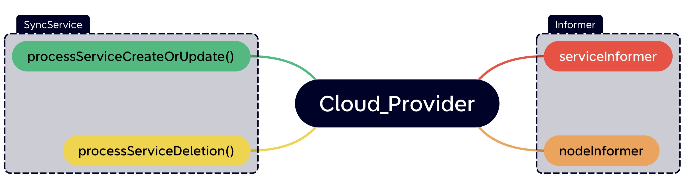
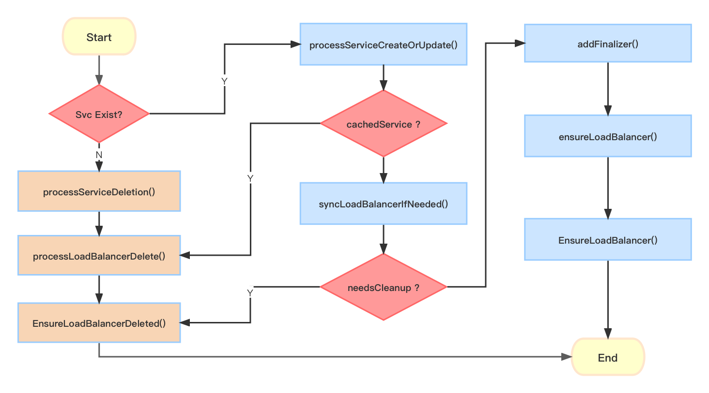

+++
title = 'K8s Cloud Provider源码解析'
date = 2024-06-17T16:59:46+08:00
draft = false
+++

## Cloud Provider 介绍
Kubernetes 的 Cloud Provider 机制是将 Kubernetes 与公有云、私有云等基础设施进行对接的关键组件。它主要具有以下功能:

1. 节点管理:实现节点的生命周期管理,如实例监控、故障检测、节点驱逐等。
2. 负载均衡:将 Kubernetes 的 Service 对象映射到云平台的负载均衡服务,如 AWS ELB、阿里云 SLB 等。
3. 存储管理:通过 FlexVolume、CSI 接口与云存储服务集成,为 Pod 提供持久化存储。

4. 路由管理:在底层网络中设置路由规则,确保 Pod 间的互联互通。 

5. 身份认证:结合云平台的 IAM 服务进行访问权限控制。

Kubernetes 的 Cloud Provider 接口使得不同的云平台能够实现自己的 Controller Manager 来集成这些功能。目前已有的Cloud Provider主要包括:

- [AWS Cloud Provider](https://github.com/kubernetes/cloud-provider-aws)
- [阿里云 Cloud Provider](https://github.com/kubernetes/cloud-provider-alibaba-cloud/tree/master) 
- [vSphere Cloud Provider](https://github.com/kubernetes/cloud-provider-vsphere)

启用 Cloud Provider 后,相关的控制组件会部署在 Kubernetes 集群中。

这种解耦设计降低了 Kubernetes 项目与具体云平台的耦合,允许云供应商进行定制化集成,也使得多云和混合云的管理变得更加复杂。关于 Cloud Provider更多的历史和背景介绍可以参考这篇来自k8s的sig-cloud-provider[cloud-provider-documentation](https://github.com/kubernetes/enhancements/tree/master/keps/sig-cloud-provider/2393-cloud-provider-documentation)
## 代码分析
本篇主要讨论的是最基础的[kubernetes/cloud-provider](https://github.com/kubernetes/cloud-provider),它是所有云供应商的基础,也是所有云供应商的实现的基础。
### 架构设计
整体的架构如下图所示:

目前它包含的Informers有:
- NodeInformer
- ServiceInformer

其主要函数包括:
- processServiceCreateOrUpdate()
- processServiceDelete()
  
它的主要逻辑如下图所示:


### 主要代码分析
#### NodeConditionPredicate
``` golang
func listWithPredicates(nodeLister corelisters.NodeLister, predicates ...NodeConditionPredicate) ([]*v1.Node, error) {
	nodes, err := nodeLister.List(labels.Everything())
	if err != nil {
		return nil, err
	}
	return filterWithPredicates(nodes, predicates...), nil
}

func filterWithPredicates(nodes []*v1.Node, predicates ...NodeConditionPredicate) []*v1.Node {
	var filtered []*v1.Node
	for i := range nodes {
		if respectsPredicates(nodes[i], predicates...) {
			filtered = append(filtered, nodes[i])
		}
	}
	return filtered
}

func respectsPredicates(node *v1.Node, predicates ...NodeConditionPredicate) bool {
	for _, p := range predicates {
		if !p(node) {
			return false
		}
	}
	return true
}
```

这段代码是一个用于过滤 Kubernetes 集群中节点（Node）的函数集合。它利用了一些自定义的类型和接口，允许用户传递一组条件（predicates）来过滤节点列表。

下面是代码中涉及的关键部分的解释：

1. `NodeConditionPredicate` 是一个自定义类型，它是一个函数签名类型（function signature）。它表示一个节点条件判断函数，该函数接收一个节点对象 `*v1.Node` 作为参数，并返回一个布尔值，指示节点是否符合某种条件。

2. `listWithPredicates` 函数接收一个 `nodeLister` 参数，这是一个用于获取节点列表的接口。它还接收一个或多个 `NodeConditionPredicate` 参数，这些是用于节点过滤的条件函数。该函数首先通过 `nodeLister.List(labels.Everything())` 获取所有的节点列表，然后将节点列表传递给 `filterWithPredicates` 函数进行进一步过滤。

3. `filterWithPredicates` 函数接收一个节点列表 `nodes` 和一组 `NodeConditionPredicate` 参数，然后遍历节点列表，并使用 `respectsPredicates` 函数来判断每个节点是否符合所有的条件。符合所有条件的节点将被添加到 `filtered` 列表中，最后返回 `filtered` 列表。

4. `respectsPredicates` 函数接收一个节点对象 `node` 和一组 `NodeConditionPredicate` 参数，然后遍历所有的条件函数。如果节点不满足其中任何一个条件函数，则返回 `false` 表示节点不符合所有条件，否则返回 `true` 表示节点符合所有条件。

这段代码的目的是为了帮助用户通过传递不同的条件函数来灵活地过滤节点列表，从而选择特定条件下的节点。例如，用户可以定义一个节点是否处于健康状态的条件函数、节点是否满足特定标签的条件函数等，然后通过 `listWithPredicates` 函数获取符合所有条件的节点列表。

#### syncLoadBalancerIfNeeded
``` golang
	if !wantsLoadBalancer(service) || needsCleanup(service) {
		// Delete the load balancer if service no longer wants one, or if service needs cleanup.
		op = deleteLoadBalancer
		newStatus = &v1.LoadBalancerStatus{}
		_, exists, err := c.balancer.GetLoadBalancer(ctx, c.clusterName, service)
		if err != nil {
			return op, fmt.Errorf("failed to check if load balancer exists before cleanup: %v", err)
		}
		if exists {
			klog.V(2).Infof("Deleting existing load balancer for service %s", key)
			c.eventRecorder.Event(service, v1.EventTypeNormal, "DeletingLoadBalancer", "Deleting load balancer")
			if err := c.balancer.EnsureLoadBalancerDeleted(ctx, c.clusterName, service); err != nil {
				if err == cloudprovider.ImplementedElsewhere {
					klog.V(4).Infof("LoadBalancer for service %s implemented by a different controller %s, Ignoring error on deletion", key, c.cloud.ProviderName())
				} else {
					return op, fmt.Errorf("failed to delete load balancer: %v", err)
				}
			}
		}
		// Always remove finalizer when load balancer is deleted, this ensures Services
		// can be deleted after all corresponding load balancer resources are deleted.
		if err := c.removeFinalizer(service); err != nil {
			return op, fmt.Errorf("failed to remove load balancer cleanup finalizer: %v", err)
		}
		c.eventRecorder.Event(service, v1.EventTypeNormal, "DeletedLoadBalancer", "Deleted load balancer")
	} else {
		// Create or update the load balancer if service wants one.
		op = ensureLoadBalancer
		klog.V(2).Infof("Ensuring load balancer for service %s", key)
		c.eventRecorder.Event(service, v1.EventTypeNormal, "EnsuringLoadBalancer", "Ensuring load balancer")
		// Always add a finalizer prior to creating load balancers, this ensures Services
		// can't be deleted until all corresponding load balancer resources are also deleted.
		if err := c.addFinalizer(service); err != nil {
			return op, fmt.Errorf("failed to add load balancer cleanup finalizer: %v", err)
		}
		newStatus, err = c.ensureLoadBalancer(ctx, service)
		if err != nil {
			if err == cloudprovider.ImplementedElsewhere {
				// ImplementedElsewhere indicates that the ensureLoadBalancer is a nop and the
				// functionality is implemented by a different controller.  In this case, we
				// return immediately without doing anything.
				klog.V(4).Infof("LoadBalancer for service %s implemented by a different controller %s, Ignoring error", key, c.cloud.ProviderName())
				return op, nil
			}
			// Use %w deliberately so that a returned RetryError can be handled.
			return op, fmt.Errorf("failed to ensure load balancer: %w", err)
		}
		if newStatus == nil {
			return op, fmt.Errorf("service status returned by EnsureLoadBalancer is nil")
		}

		c.eventRecorder.Event(service, v1.EventTypeNormal, "EnsuredLoadBalancer", "Ensured load balancer")
	}
```
这段代码是一个处理负载均衡器（Load Balancer）的控制器逻辑，它根据 Service 对象的状态来执行负载均衡器的创建、更新和删除操作。

首先，代码通过两个条件函数 `wantsLoadBalancer(service)` 和 `needsCleanup(service)` 来判断是否需要删除现有的负载均衡器或者创建/更新一个负载均衡器。

1. `wantsLoadBalancer(service)` 是一个条件函数，它接收一个 Service 对象 `service` 作为参数，返回一个布尔值。该函数用于判断该 Service 是否需要拥有一个负载均衡器，如果返回 `false`，则表示 Service 不需要负载均衡器。

2. `needsCleanup(service)` 是另一个条件函数，用于判断是否需要对现有负载均衡器进行清理。它接收一个 Service 对象 `service` 作为参数，返回一个布尔值，如果返回 `true`，则表示负载均衡器需要进行清理。

根据这两个条件函数的结果，代码会执行以下两种操作之一：

- 如果 `!wantsLoadBalancer(service) || needsCleanup(service)` 条件成立，则表示需要删除现有负载均衡器或进行清理操作。代码会执行以下步骤：
  - 设置操作类型 `op` 为 `deleteLoadBalancer`。
  - 创建一个空的 `v1.LoadBalancerStatus` 对象 `newStatus`。
  - 通过 `c.balancer.GetLoadBalancer(ctx, c.clusterName, service)` 检查负载均衡器是否存在。如果存在，则删除该负载均衡器，并删除 Service 对象上的负载均衡器清理 finalizer。
  - 发送相应的事件，记录删除操作。

- 如果条件 `!wantsLoadBalancer(service) || needsCleanup(service)` 不成立，则表示需要创建或更新负载均衡器。代码会执行以下步骤：
  - 设置操作类型 `op` 为 `ensureLoadBalancer`。
  - 添加负载均衡器清理 finalizer 到 Service 对象上。
  - 调用 `c.ensureLoadBalancer(ctx, service)` 函数来确保负载均衡器的创建或更新，该函数返回 `newStatus`，即负载均衡器的状态。
  - 发送相应的事件，记录创建或更新操作。

值得注意的是，代码中通过 `cloudprovider.ImplementedElsewhere` 错误码来处理负载均衡器功能被其他控制器实现的情况。在这种情况下，该控制器不执行任何操作，只是记录相应的信息。

总的来说，这段代码是负责处理 Kubernetes 集群中 Service 对象的负载均衡器操作的逻辑，根据 Service 对象的状态和用户定义的条件函数来进行相应的处理。

#### TestServiceCache

下面的测试代码展示了一种结构化、测试数据隔离、全面和可维护的测试方法，适用于对复杂逻辑的测试，并能有效保证代码质量和正确性。

```go
    func TestServiceCache(t *testing.T) {

	//ServiceCache a common service cache for all the test cases
	sc := &serviceCache{serviceMap: make(map[string]*cachedService)}

	testCases := []struct {
		testName     string
		setCacheFn   func()
		checkCacheFn func() error
	}{{
		testName: "Add",
		setCacheFn: func() {
			cS := sc.getOrCreate("addTest")
			cS.state = defaultExternalService()
		},
		checkCacheFn: func() error {
			//There must be exactly one element
			if len(sc.serviceMap) != 1 {
				return fmt.Errorf("Expected=1 Obtained=%d", len(sc.serviceMap))
			}
			return nil
		},
	}, {
		testName: "Del",
		setCacheFn: func() {
			sc.delete("addTest")

		},
		checkCacheFn: func() error {
			//Now it should have no element
			if len(sc.serviceMap) != 0 {
				return fmt.Errorf("Expected=0 Obtained=%d", len(sc.serviceMap))
			}
			return nil
		},
	}, {
		testName: "Set and Get",
		setCacheFn: func() {
			sc.set("addTest", &cachedService{state: defaultExternalService()})
		},
		checkCacheFn: func() error {
			//Now it should have one element
			Cs, bool := sc.get("addTest")
			if !bool {
				return fmt.Errorf("is Available Expected=true Obtained=%v", bool)
			}
			if Cs == nil {
				return fmt.Errorf("cachedService expected:non-nil Obtained=nil")
			}
			return nil
		},
	}, {
		testName: "ListKeys",
		setCacheFn: func() {
			//Add one more entry here
			sc.set("addTest1", &cachedService{state: defaultExternalService()})
		},
		checkCacheFn: func() error {
			//It should have two elements
			keys := sc.ListKeys()
			if len(keys) != 2 {
				return fmt.Errorf("elements Expected=2 Obtained=%v", len(keys))
			}
			return nil
		},
	}, {
		testName:   "GetbyKeys",
		setCacheFn: nil, //Nothing to set
		checkCacheFn: func() error {
			//It should have two elements
			svc, isKey, err := sc.GetByKey("addTest")
			if svc == nil || isKey == false || err != nil {
				return fmt.Errorf("Expected(non-nil, true, nil) Obtained(%v,%v,%v)", svc, isKey, err)
			}
			return nil
		},
	}, {
		testName:   "allServices",
		setCacheFn: nil, //Nothing to set
		checkCacheFn: func() error {
			//It should return two elements
			svcArray := sc.allServices()
			if len(svcArray) != 2 {
				return fmt.Errorf("Expected(2) Obtained(%v)", len(svcArray))
			}
			return nil
		},
	}}

	for _, tc := range testCases {
		if tc.setCacheFn != nil {
			tc.setCacheFn()
		}
		if err := tc.checkCacheFn(); err != nil {
			t.Errorf("%v returned %v", tc.testName, err)
		}
	}
}
```
每个测试用例都涉及到 serviceCache 结构体的各种操作，包括添加元素、删除元素、获取元素等。通过这些测试用例，可以确保 serviceCache 在各种情况下的行为符合预期，并且能够正确地管理服务对象的状态