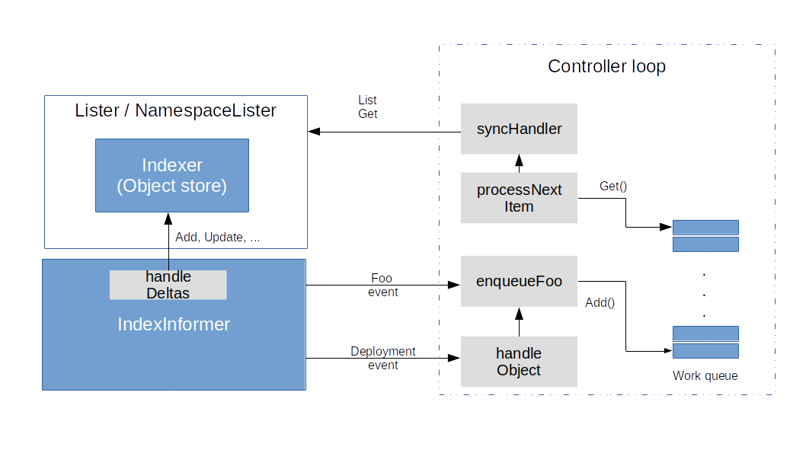

+++
title = '深入了解Kubernetes控制器对象存储（object stores）和索引器（indexers）'
date = 2024-06-18T10:14:37+08:00
draft = false
+++

> 本文是[Understanding Kubernetes controllers part II – object stores and indexers](https://leftasexercise.com/2019/07/11/understanding-kubernetes-controllers-part-ii-object-stores-and-indexers/)的中文翻译版本，内容有删减


基本上，我们已经学会了如何使用 Kubernetes Go client来检索 Kubernetes 资源的信息，因此我们可以在我们的controller中简单地执行这个操作。然而，这有点低效。假设，例如，你正在使用多个工作线程，就像我们所做的那样。那么你可能会一遍又一遍地检索相同的信息，对 API 服务器造成很大负载。为了避免这种情况，可以使用一种特殊的 Kubernetes Informers 类型，称为**index informers**，它们构建一个线程安全的对象存储作为缓存。当集群的状态发生变化时，Informer 不仅会调用我们`controller`的处理函数，还会执行必要的更新以保持缓存的最新状态。由于缓存具有处理索引的额外能力，因此被称为 **Indexer**。因此，在今天的文章末尾，以下图片将呈现出来。




在本文的其余部分，我们将更详细地讨论索引器及其与 Informer 的交互，而在下一篇文章中，我们将学习如何创建和使用 Informer，并深入了解它们的内部运作。

## Watches and resource versions

在我们讨论 Informers 和 Indexers 之前，我们必须了解客户端可以使用的基本机制，以跟踪集群状态。为了实现这一点，[Kubernetes API](https://kubernetes.io/docs/reference/using-api/api-concepts/) 提供了一种称为 **watch** 的机制。最好通过一个例子来解释这个概念。

在继续之前，请确保你有一个运行中的 Kubernetes 集群。我们将使用 curl 直接与 API 进行交互。为了避免必须在请求中添加令牌或证书，我们将使用 kubectl 代理机制。因此，请在另一个单独的终端中运行：

```shell
$ kubectl proxy
```

此时你应该看到一个消息，表示该代理正在本地主机的某个端口上监听（通常是8001）。发送到该端口的任何请求将被转发到 Kubernetes API 服务器。为了访问我们的集群，让我们首先启动一个单独的 HTTPD。

```shell
$ kubectl run alpine --image=httpd:alpine

```

然后我们使用`CURL`来获取默认命名空间中正在运行的 pod 列表。

```shell
$ curl localhost:8001/api/v1/namespaces/default/pods
{
  "kind": "PodList",
  "apiVersion": "v1",
  "metadata": {
    "selfLink": "/api/v1/namespaces/default/pods",
    "resourceVersion": "6834"
  },
  "items": [
    {
      "metadata": {
        "name": "alpine-56cf65bbfc-tzqqx",
        "generateName": "alpine-56cf65bbfc-",
        "namespace": "default",
        "selfLink": "/api/v1/namespaces/default/pods/alpine-56cf65bbfc-tzqqx",
        "uid": "584ddf85-5f8d-11e9-80c0-080027696a3f",
        "resourceVersion": "6671",
--- REDACTED ---
```
正如预期的那样，你将获得一个 JSON 编码的对象类型 _PodList_。有趣的部分是元数据中的数据。你会看到有一个字段 _resourceVersion_。本质上，资源版本是一个随时间增加的数字，它唯一地标识集群的某个状态。

现在，Kubernetes API允许您请求**watch**，并以此资源版本作为起点。要手动完成此操作，请输入

```shell
$ curl -v localhost:8001/api/v1/namespaces/default/pods?watch=1&resourceVersion=6834
```

如果我们查看输出，你会发现这个请求返回了一个带有传输编码“chunked”的 HTTP 响应。这在 [RFC 7230](https://tools.ietf.org/html/rfc7230#section-4.1) 中有规定，并将客户端置于流模式，即连接将保持打开状态，API server将继续以小块的方式发送更新。这将使 curl 进入后台运行，同时 curl 将继续将接收到的数据打印到终端。如果你现在在集群中创建额外的 pod 或删除现有的 pod，你将继续看到接收到的通知，通知你有关事件的信息。每个通知都包含一个类型（ADDED、MODIFIED、ERROR 或 DELETED）和一个[Event](https://kubernetes.io/docs/reference/kubernetes-api/cluster-resources/event-v1/)。

这为我们提供了一种以高效的方式获取集群完整状态的方法。我们首先使用普通的 API 请求列出所有资源。然后，我们记住响应中的资源版本，并将该资源版本作为监视的起点。每当我们收到关于更改的通知时，我们相应地更新本地数据。基本上，这正是`Informer`和`Indexer`组合所做的事情。

## Caching mechanisms and indexers

一个indexer是一个实现了接口 _cache.Indexer_ 的对象。这个接口是从 _cache.Store_ 派生出来的，所以让我们先来研究一下它。它的定义在 [store.go](https://github.com/kubernetes/client-go/blob/master/tools/cache/store.go)

```go
type Store interface {
	Add(obj interface{}) error
	Update(obj interface{}) error
	Delete(obj interface{}) error
	List() []interface{}
	ListKeys() []string
	Get(obj interface{}) (item interface{}, exists bool, err error)
	GetByKey(key string) (item interface{}, exists bool, err error)
	Replace([]interface{}, string) error
	Resync() error
}
```

所以 store 基本上是一个我们可以向其中添加对象、检索对象、更新对象或删除对象的东西。接口本身并不对键做任何假设，但是当你创建一个新的 store 时，你提供了一个**key function**，它从一个对象中提取键，并具有以下签名。

```go
`type KeyFunc func(obj interface{}) (string, error)`
```
使用[store](https://github.com/kubernetes/client-go/blob/master/tools/cache/store.go)是非常方便和简单的，你可以在[这里](https://github.com/christianb93/kubernetes-client-examples/blob/master/example4/main.go)找到一个简短的例子。


让我们验证一下，正如上面的图表所述，`Informer` 和 `Lister`都引用了相同的索引器。为了查看这一点，让我们看一下我们的 [sample controller](https://github.com/kubernetes/sample-controller/blob/master/controller.go) 的创建过程。

当由函数`_NewController_` 创建一个新controller时，此函数接受一个 `_DeploymentInformer_` 和一个 `_FooInformer_`。这些都是提供对相应资源的实际 `Informer` 和 `Lister` 访问的接口。让我们以 `_FooInformer_` 为例。`Lister` 的实际创建方法如下。

```go
func (f *fooInformer) Lister() v1alpha1.FooLister {
	return v1alpha1.NewFooLister(f.Informer().GetIndexer())
}
```

`Informer`和`Indexer`之间的通信是通过函数 `_handleDeltas_` 完成的，该函数接收一个 `_Delta_ `对象列表，其定义在 [delta_fifo.go](https://github.com/kubernetes/client-go/blob/master/tools/cache/delta_fifo.go) 中（我们将在下一篇文章中了解更多关于这是如何工作的）。如果我们查看这个函数，我们会发现它不仅调用所有注册的处理函数（通过 `_processor_`），而且根据 `delta` 的类型还调用存储的 `_Add_`、`_Update_` 和 `_Delete_` 方法。
```go
// DeltaFIFOOptions is the configuration parameters for DeltaFIFO. All are
// optional.
type DeltaFIFOOptions struct {

	// KeyFunction is used to figure out what key an object should have. (It's
	// exposed in the returned DeltaFIFO's KeyOf() method, with additional
	// handling around deleted objects and queue state).
	// Optional, the default is MetaNamespaceKeyFunc.
	KeyFunction KeyFunc

	// KnownObjects is expected to return a list of keys that the consumer of
	// this queue "knows about". It is used to decide which items are missing
	// when Replace() is called; 'Deleted' deltas are produced for the missing items.
	// KnownObjects may be nil if you can tolerate missing deletions on Replace().
	KnownObjects KeyListerGetter

	// EmitDeltaTypeReplaced indicates that the queue consumer
	// understands the Replaced DeltaType. Before the `Replaced` event type was
	// added, calls to Replace() were handled the same as Sync(). For
	// backwards-compatibility purposes, this is false by default.
	// When true, `Replaced` events will be sent for items passed to a Replace() call.
	// When false, `Sync` events will be sent instead.
	EmitDeltaTypeReplaced bool

	// If set, will be called for objects before enqueueing them. Please
	// see the comment on TransformFunc for details.
	Transformer TransformFunc
}
```

我们现在对sample controller的工作原理有了一个相当完整的了解。`Informer`利用Kubernetes API及其基于资源版本的监视机制来获取集群状态的更新。这些更新用于维护一个对象存储，反映集群的当前状态，并调用定义的事件处理函数。`controller`向`Informer`注册其函数，以在资源发生更改时调用这些函数。然后，它可以访问对象存储，轻松检索资源的当前状态，并采取必要的措施推动系统朝向目标状态发展。